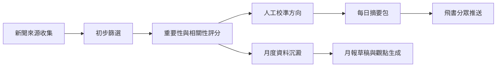

# 海外投資部行業新聞篩選與推送機制

## 目標

搭建一個「每日新聞篩選、人工可控佈局、飛書分眾推送、月報洞察輔助」的閉環機制，幫助決策層、項目負責人、拓展負責人及部門同事快速獲取與海外投資相關的高價值資訊。

## 整體流程



## 一、篩選流程

起步階段採用「公開來源 + 人工重點來源」混合方式，避免一開始依賴複雜系統或付費數據庫。

新聞來源建議分為四類：

- 宏觀與政策：國家部委、香港政府、一帶一路相關機構、多邊開發銀行、各國基建與投資主管部門。
- 行業與市場：建築、基建、能源、交通、房建、PPP、投融資、ESG、地緣風險等媒體與研究機構。
- 區域重點：中東、東南亞、拉美、非洲、歐洲等公司重點市場的政府公告與主流財經媒體。
- 競爭與項目：中資建築央企、國際承包商、重大招標、併購、融資、項目落地新聞。

每條新聞進入系統後，至少保留以下欄位：

- 標題
- 發佈時間
- 來源名稱
- 原文鏈接
- 地區/國家
- 行業分類
- 關鍵詞
- 100-200字摘要
- 重要性評分
- 相關程度評分
- 推薦推送對象
- 人工標記狀態

## 二、佈局與篩選標準

平台內應支持人工篩選方向，讓部門可以調整近期關注重點，例如「中東基建」、「東南亞能源轉型」、「境外PPP」、「競爭對手動態」、「重大政策風險」。

建議使用三層篩選機制：

1. 基礎過濾：排除重複、過舊、低可信來源、與海外投資無關的新聞。
2. 評分排序：根據重要性、相關程度、時間新鮮度、來源可靠性、可行動性進行排序。
3. 人工校準：每日由指定同事快速審核Top新聞，調整分類、摘要、推送對象和是否入庫。

建議評分維度如下：

- 重要性：是否涉及重大政策、重大項目、重大投資、戰略市場、競爭格局變化。
- 相關程度：是否與公司海外投資、基建、房建、能源、交通、投融資、區域拓展直接相關。
- 時間因素：越新的新聞權重越高，但重大政策和項目可保留較長有效期。
- 可行動性：是否能支持領導決策、項目跟進、拓展線索、風險預警或月報觀點。
- 可信度：優先政府、交易所、央企公告、主流媒體、國際機構和權威研究機構。

## 三、每日推送流程

飛書推送建議採用「分眾摘要 + 原文跳轉」格式，不直接把所有新聞塞給所有人。

推送對象建議分為三類：

- 決策層領導：每日3-5條，高度濃縮，突出重大趨勢、風險、機會和建議關注點。
- 項目負責人：按國家、項目類型、融資模式、業主動態推送，突出項目跟進價值。
- 拓展負責人：按區域、市場機會、招標、政策窗口、競爭對手動態推送。

每日推送內容建議格式：

```text
【海外投資部每日行業快訊】
日期：YYYY-MM-DD

1. 新聞標題
地區/行業：中東 / 基建投資
重要性：高
關鍵詞：PPP、主權基金、交通基建
摘要：100-200字說明事件、背景、對公司的可能意義。
建議關注：是否需要區域團隊跟進、是否影響現有項目、是否形成拓展線索。
原文：鏈接
```

飛書機器人落地時，應與IT確認以下事項：

- 是否使用飛書自定義機器人、企業內部應用，或公司統一消息推送能力。
- 是否允許按群、按人、按角色推送。
- 是否需要內網部署、權限審批、日誌留存和數據安全審查。
- 外部新聞鏈接是否可直接跳轉，或需要通過公司安全網關。
- AI摘要與月報生成是否允許使用外部模型，或必須使用公司內部大模型/私有化服務。

## 四、月報輔助機制

月報不應只是新聞堆疊，而應形成「數據 + 趨勢 + 觀點 + 建議」的半自動化輸出。

月報建議包含：

- 本月重點市場動態：按區域總結政策、投資、項目和風險。
- 重大項目與投資線索：列出可跟進的項目、招標、併購、融資和合作機會。
- 競爭對手動態：中資央企、國際承包商、區域龍頭公司的新項目和市場佈局。
- 數據統計：新聞數量、地區分佈、行業分佈、關鍵詞熱度、重大事件數量、風險類事件數量。
- 部門觀點：對市場機會、風險、政策方向、公司拓展策略提出初步判斷。
- 建議行動：哪些線索需要跟進、哪些市場需要預警、哪些議題需要向領導專題匯報。

月報生成方式建議是「系統生成初稿 + 部門同事審核補充」，避免完全依賴AI輸出觀點。

## 五、MVP試點方案

建議先做一個4週試點，不追求一步到位。

第1週：確定範圍與來源

- 明確重點區域、重點行業、重點關鍵詞和推送對象。
- 建立50-100個公開來源與人工重點來源清單。
- 設計新聞欄位、評分規則和每日推送模板。

第2週：人工半自動運行

- 每天收集新聞，使用表格或簡易平台整理。
- 人工選出Top 5-10條，補充關鍵詞、摘要、分類和原文鏈接。
- 先由人工發送飛書群消息，驗證內容格式是否適合領導和業務同事閱讀。

第3週：引入自動摘要與初步排序

- 使用AI工具生成摘要、關鍵詞和初步分類。
- 建立重要性、相關程度、時間新鮮度的初步評分邏輯。
- 每日仍保留人工確認，避免錯推和誤判。

第4週：試接飛書機器人與月報草稿

- 與IT確認飛書機器人或企業應用方案。
- 將每日快訊改為半自動推送。
- 根據4週新聞庫生成第一版月報草稿，測試是否能支持部門同事寫正式月報。

## 六、角色分工

- 業務負責人：確定篩選方向、推送對象、月報觀點和最終口徑。
- 信息整理同事：每日審核新聞、校準分類、補充摘要和關鍵詞。
- IT同事：飛書機器人、權限、部署、安全、日誌和數據接口。
- AI/自動化支持：新聞抓取、去重、摘要、評分、月報草稿生成。

## 七、建議交付物

- 新聞來源清單
- 關鍵詞與分類體系
- 新聞評分規則
- 每日飛書推送模板
- 月報模板
- MVP試點運行表
- IT對接需求清單

## 八、成功標準

MVP試點完成後，建議用以下指標判斷是否值得繼續投入：

- 每日推送新聞中，至少70%被認為與部門工作相關。
- 決策層和業務負責人認為摘要足夠快讀，不需要點開原文也能掌握核心。
- 每月至少沉澱10條以上可跟進的投資、項目、政策或風險線索。
- 月報初稿能節省部門同事30%以上整理時間。
- 飛書推送不造成信息轟炸，能按角色分眾接收。