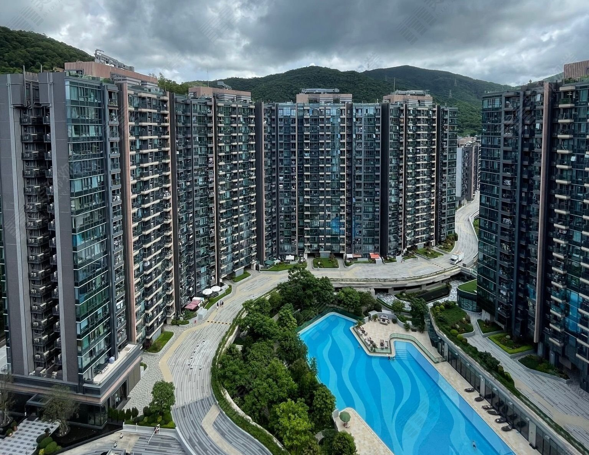
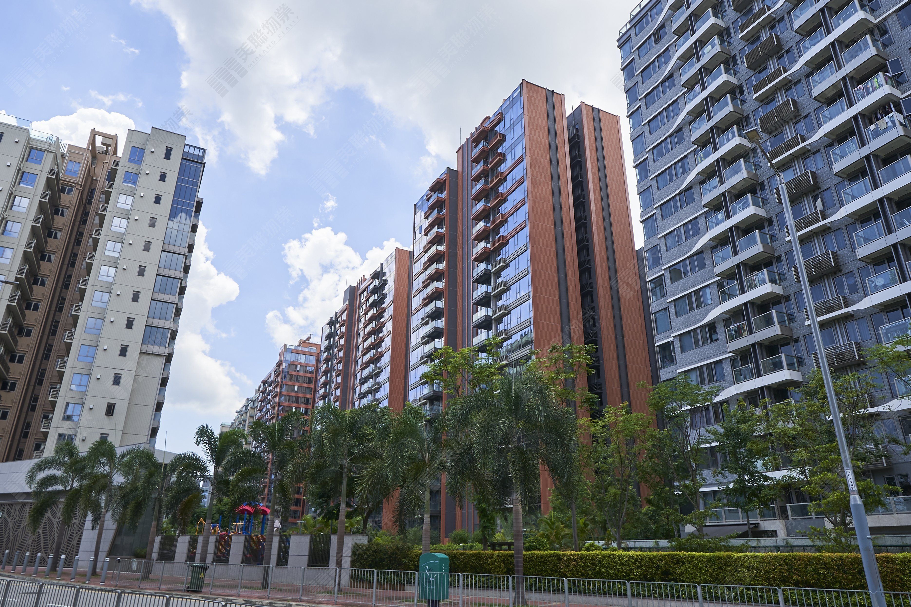
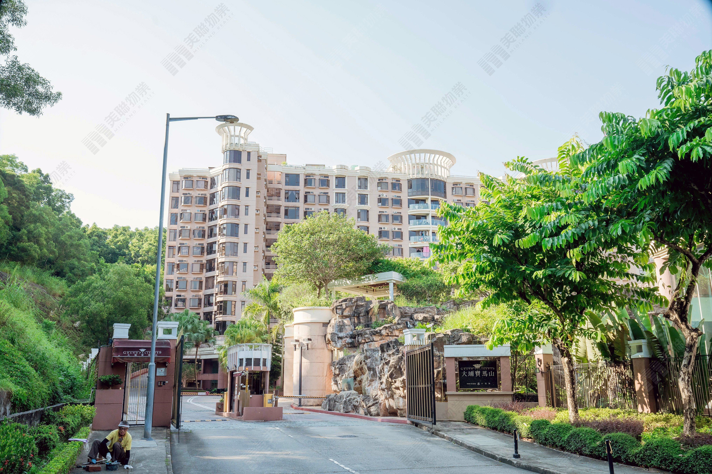
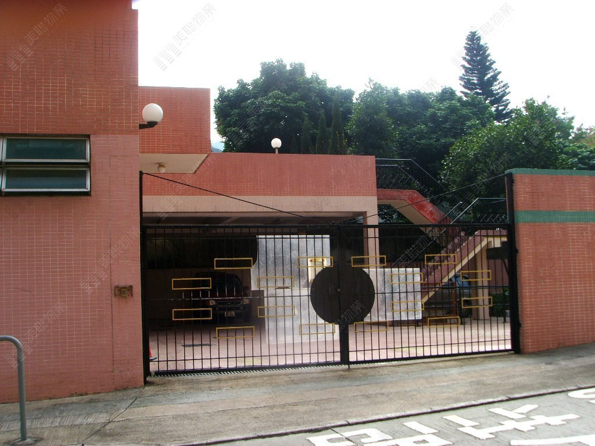
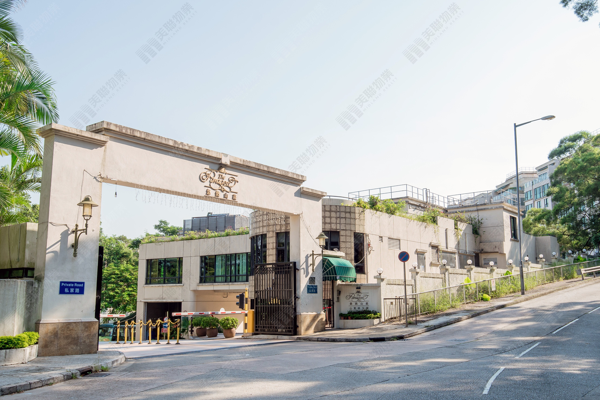
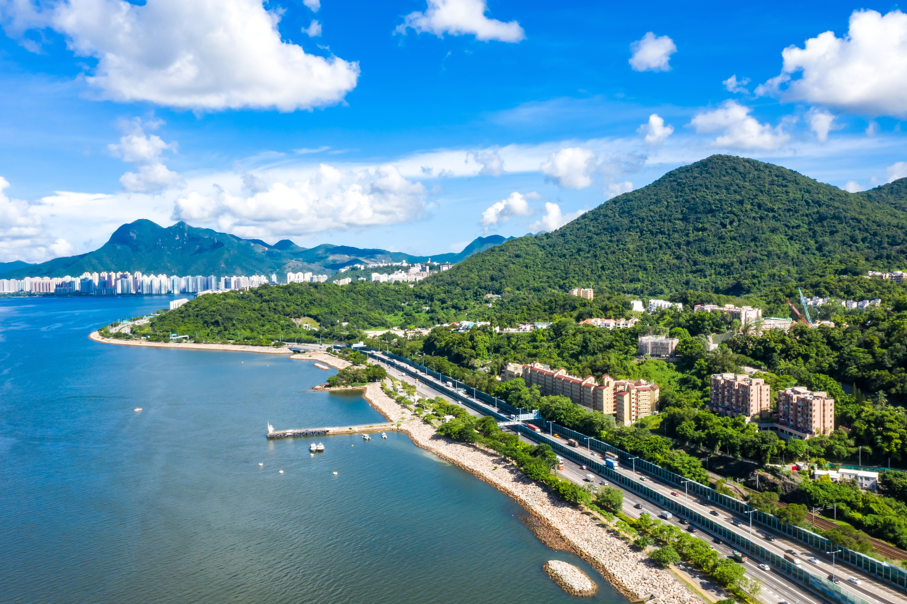

# 周邊樓盤項目簡介

**用途**：黃宜坳第一期高尚住宅市調／簡報配套  
**格式**：各盤統一約 100 字項目簡介 + 代表圖片  
**圖片來源**：美聯物業屋苑專頁（截至 2026-06-11）  
**整理日期**：2026-06-11

---

## 1. 天鑽 The Regent

天鑽（The Regent）位於大埔創新路，由新鴻基發展，2020年入伙，17座共1,620伙，實用377至944呎以上。屋苑設會所及泳池，東鄰黃宜坳第一期地塊，屬84校網，為區內交投最活躍的新建大型屋苑標竿。

---

## 2. 雲匯 St Martin

雲匯（St Martin）位於白石角科進路12號，由新鴻基發展，2019至2020年分期落成，2期10座共1,444伙，實用277至1,279呎，間隔由開放式至四房。設Club St Martin會所及泳池，鄰近白石角海濱及科學園，交通便捷。

---

## 3. 海日灣II Centra Horizon

海日灣II（Centra Horizon）位於白石角創新路18號，由億京發展，2020年落成，12座共1,408伙，實用243至2,828呎。紅磚外觀具地標特色，設會所、泳池及兒童設施，鄰近科學園及大學站，為白石角東部大型屋苑。

---

## 4. 大埔寶馬山 Pacific Palisades

大埔寶馬山（Pacific Palisades）位於山賢路8號，由信和置業發展，1997年入伙，9座共547伙，實用495至1,033呎。屋苑依山而建，環境清幽，東鄰黃宜坳項目，屬84校網，為區內成熟中密度住宅，二手交投穩定。

---

## 5. 雍怡雅苑 Chateau Royale

雍怡雅苑（Chateau Royale）位於雍宜路1號，由新鴻基發展，1998年落成，68座低密度獨立屋，實用1,805至2,352呎。屋苑設會所及泳池，西鄰黃宜坳第一期地塊，屬區內罕有花園洋房組群，私隱度高、交投疏落。

---

## 6. 悠然山莊 The Paragon

悠然山莊（The Paragon）位於山賢路9號，由加文發展，1997年入伙，共242伙，實用454至1,878呎。低密度設計，依山臨海，東南毗鄰黃宜坳項目，與寶馬山同處山麓帶，為區內優質舊屋苑之一。

---

## 7. 偉東·雍宜山莊 Grand Dynasty View

偉東·雍宜山莊（Grand Dynasty View）位於大埔下黃宜坳，為低密度村屋式住宅，約32伙，戶均實用逾2,000呎。與黃宜坳第一期地塊同處山坳腹地，環境寧靜、綠意盎然，屬區內罕有全幢獨立洋房供應。

---

## 備註

- 「雲匯」即市場慣稱之「雲滙」（St Martin），資料見 [周邊樓盤租賃及成交對標表.csv](./周邊樓盤租賃及成交對標表.csv)。
- 圖片檔案目錄：`assets/estates/`（可用 `python scripts/fetch_estate_images.py` 重新抓取）。
- 天鑽、雲匯、海日灣II 位於白石角／創新路一帶，與黃宜坳山麓屋苑互為新舊樓市參考；其餘五盤為黃宜坳直接毗鄰或同區可比屋苑。
