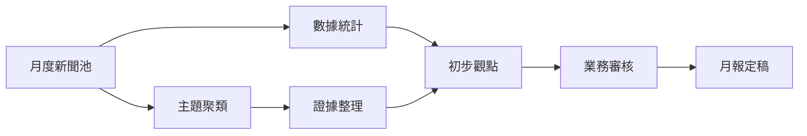

# 07 月報洞察生成方法

月報的價值不在於把每日新聞重新排列，而在於從新聞中提煉趨勢、風險、線索和建議。MVP階段建議採用「每日素材標記 + 數據統計 + 人工判斷 + AI輔助初稿」的方式。

**素材入口：** 市場部負責人每日維護 `templates/daily-internal-monthly-markers.md` 及新聞登記表中「入月報」記錄。不再使用單獨的月報 Word/Markdown 模板文件，月報結構由市場部按部門慣例編排。

## 月報素材入選標準

新聞符合以下任一條件，即可標記為月報素材：

- 總分不低於65分。
- 重要性評分為5分。
- 涉及重大項目、重大政策或重大風險。
- 被領導、項目負責人或拓展負責人反饋為有用。
- 能支持某一區域、行業或競爭對手的趨勢判斷。

## 月報生成流程



## 步驟一：做基礎統計

從新聞登記表匯總以下數據：

- 本月入庫新聞總數。
- 本月推送新聞總數。
- 本月月報素材數。
- 各區域新聞數和高重要性新聞數。
- 各行業新聞數。
- 風險類新聞數。
- Top 10關鍵詞。
- 競爭對手動態數量。

## 步驟二：按主題聚類

將月報素材按以下主題整理，每個主題至少要有2-3條新聞支撐，否則只作單條線索，不上升為趨勢。

| 主題 | 判斷問題 |
| --- | --- |
| 政策窗口 | 是否出現北都、城中學舍、啟德交通或改建相關的新政策、招標或審批安排？ |
| 項目機會 | 是否有可跟進的重大項目、業主計劃或融資安排？ |
| 資金變化 | 政府注資、企業融資、資產出售或貸款安排是否影響項目節奏？ |
| 競爭格局 | 競爭對手是否在特定市場集中中標或加碼投資？ |
| 風險預警 | 是否出現主權債務、外匯、制裁、合規或政治風險？ |
| 技術和ESG | 綠色建築、能源轉型、碳規則是否影響項目模式？ |

## 步驟三：形成觀點

每條觀點建議使用以下結構：

```text
觀點：一句話說清楚判斷。
依據：列出2-3條新聞或數據支持。
影響：說明對固定專題研判、項目跟進或月報觀點的意義。
建議：提出可執行的下一步。
```

示例：

```text
觀點：洪水橋產業園和北都產業規劃仍是短期最高優先級監測方向之一。
依據：本月HKET多篇報道涉及北都片區開發、產業園公司、土地或基建安排。
影響：相關信息可能影響片區開發節奏、產業導入、合作機會和後續項目判斷。
建議：優先建立洪水橋產業園新聞台賬，按政策、土地、公司、招商和基建五類持續跟進。
```

## 步驟四：人工審核

月報初稿必須由業務同事審核，重點檢查：

- 觀點是否超出新聞證據。
- 數字、金額、項目名稱和機構名稱是否準確。
- 是否涉及內部未公開信息。
- 建議行動是否明確到負責方向。
- 是否需要刪除敏感或不適合上報的內容。

## AI輔助提示詞

如公司允許使用AI，可將已審核的公開新聞摘要輸入公司批准的AI工具，使用以下提示詞生成初稿。不要輸入未公開內部資料。

```text
你是中國建築公司香港海外投資部的行業研究助理。請根據以下已審核的公開新聞摘要，生成一份月報初稿。

要求：
1. 不要編造新聞中沒有的信息。
2. 每個觀點都要列出對應新聞依據。
3. 報告要包含區域動態、項目線索、競爭對手、風險預警、數據統計和建議行動。
4. 語氣應適合提交給部門和領導作決策參考。
5. 對不確定的信息標記為「需進一步核實」。

新聞素材：
【在此粘貼已審核新聞摘要】
```

## 反饋收集

月報發出後，建議向內部讀者收集以下反饋：

| 問題 | 評分或回答 |
| --- | --- |
| 本月觀點是否有助於判斷市場方向？ | 1-5分 |
| 項目線索是否具備跟進價值？ | 1-5分 |
| 風險提示是否及時？ | 1-5分 |
| 數據統計是否清晰？ | 1-5分 |
| 哪些內容應增加？ | 開放填寫 |
| 哪些內容應減少？ | 開放填寫 |
| 下月希望重點關注哪些市場或議題？ | 開放填寫 |
